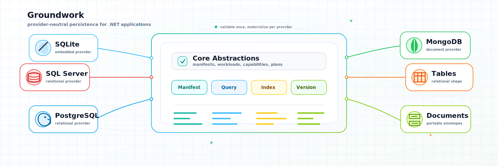

# Groundwork



Groundwork is a provider-neutral persistence foundation for .NET applications. Modules describe storage intent through manifests, and providers translate those manifests into concrete relational or document database structures.

This repository contains the standalone Groundwork library.

## Projects

- `Groundwork.Core`: manifests, storage intent, provider capability checks, validation, materialization concepts, and physicalization projection rules.
- `Groundwork.Documents`: portable document-store contracts and document planning.
- `Groundwork.Relational`: relational planning and shared relational document-store infrastructure.
- `Groundwork.Sqlite`: SQLite materialization and document-store provider.
- `Groundwork.SqlServer`: SQL Server materialization and document-store provider.
- `Groundwork.PostgreSql`: PostgreSQL materialization and document-store provider.
- `Groundwork.MongoDb`: MongoDB materialization and document-store provider.

## Requirements

- .NET SDK 10.0 or newer.
- Docker for provider tests that use container-backed databases.

## Build And Test

```bash
dotnet test tests/Groundwork/Groundwork.Tests/Groundwork.Tests.csproj
dotnet test tests/Groundwork/Groundwork.Sqlite.Tests/Groundwork.Sqlite.Tests.csproj
dotnet test samples/Groundwork.SupportTickets.Tests/Groundwork.SupportTickets.Tests.csproj
```

Provider integration suites can be run separately when Docker-backed databases are available:

```bash
dotnet test tests/Groundwork/Groundwork.MongoDb.Tests/Groundwork.MongoDb.Tests.csproj
dotnet test tests/Groundwork/Groundwork.RelationalProviders.Tests/Groundwork.RelationalProviders.Tests.csproj
```

The support-ticket sample is an ASP.NET Core application backed by the same provider-neutral manifest used in its tests. It defaults to SQLite and can opt into optimized physicalization:

```bash
Groundwork__Provider=Sqlite \
Groundwork__ConnectionString="Data Source=support-tickets.db" \
Groundwork__Physicalization=Optimized \
dotnet run --project samples/Groundwork.SupportTickets/Groundwork.SupportTickets.csproj
```

The sample also accepts `PostgreSql`, `SqlServer`, and `MongoDb` as `Groundwork__Provider` values when the matching connection string is supplied. For MongoDB, set `Groundwork__DatabaseName` when you want a database name other than `groundwork_support_tickets`.

## Use Groundwork

Groundwork starts with a provider-neutral `StorageManifest`. The manifest below declares a support-ticket document/table shape with string IDs, JSON content, optimistic concurrency, a unique ticket-number index, and queryable customer/status/assignee/priority indexes.

```csharp
using Groundwork.Core.Indexing;
using Groundwork.Core.Manifests;
using Groundwork.Core.Queries;
using Groundwork.Core.Intents;

const string DocumentKind = "supportTicket";
const string SchemaVersion = "1.0.0";

var manifest = new StorageManifest(
    new StorageManifestIdentity("support-tickets"),
    new StorageManifestOwner("sample.support"),
    new StorageManifestVersion(SchemaVersion),
    [
        new StorageUnit(
            new StorageUnitIdentity(DocumentKind),
            "Support ticket",
            StorageIntent.PortableDocument(),
            LifecyclePolicy.Mutable,
            IdentityPolicy.StringId(),
            TenancyPolicy.None,
            ConcurrencyPolicy.Optimistic(),
            SerializationPolicy.Json(),
            [
                Keyword("by-ticket-number", "ticketNumber", isUnique: true),
                Keyword("by-customer", "customerId"),
                Keyword("by-status", "status"),
                Keyword("by-assignee", "assigneeId"),
                Keyword("by-priority", "priority")
            ],
            [
                Query("find-by-ticket-number", "by-ticket-number"),
                Query("list-by-customer", "by-customer", QuerySortSupport.Both, QueryPagingSupport.Offset),
                Query("list-by-status", "by-status", QuerySortSupport.Both, QueryPagingSupport.Offset),
                Query("list-by-assignee", "by-assignee", QuerySortSupport.Both, QueryPagingSupport.Offset),
                Query("list-by-priority", "by-priority", QuerySortSupport.Both, QueryPagingSupport.Offset)
            ],
            PhysicalizationPolicy.Portable)
    ],
    new HashSet<string> { "schema-history", "optimistic-concurrency" },
    []);

static IndexDeclaration Keyword(string identity, string field, bool isUnique = false) =>
    new(
        identity,
        [new IndexField(field)],
        IndexValueKind.Keyword,
        isUnique,
        true,
        MissingValueBehavior.Excluded,
        new HashSet<PortableQueryOperation> { PortableQueryOperation.Equal });

static PortableQueryDeclaration Query(
    string identity,
    string indexName,
    QuerySortSupport sort = QuerySortSupport.None,
    QueryPagingSupport paging = QueryPagingSupport.None) =>
    new(
        identity,
        indexName,
        new HashSet<PortableQueryOperation> { PortableQueryOperation.Equal },
        sort,
        paging);
```

### Storage intent

Storage intent declares whether a unit fits Groundwork's portable document/table contract or needs additional evidence or provider-specific behavior:

- `StorageIntent.PortableDocument()`: Groundwork's default portable document/table contract.
- `StorageIntent.BenchmarkGated(...)`: possible future Groundwork support, but requires benchmark or correctness evidence.
- `StorageIntent.SpecializedProvider(...)`: requires a provider or module-specific contract.

Use specialized or benchmark-gated intent when correctness depends on behavior beyond ordinary document storage, such as atomic claiming, lease recovery, ordered consumption, retry recovery, idempotency, retention, atomic commit behavior, concurrency evidence, or operational diagnostics.

Configure SQLite by materializing the manifest, then create an `IDocumentStore` over the same connection:

```csharp
using Groundwork.Core.Capabilities;
using Groundwork.Documents.Store;
using Groundwork.Sqlite.Documents;
using Groundwork.Sqlite.Materialization;
using Microsoft.Data.Sqlite;

var connection = new SqliteConnection("Data Source=support-tickets.db");
var provider = new ProviderIdentity("groundwork-sqlite", "1.0.0");

await new SqliteGroundworkMaterializer(connection).MaterializeAsync(manifest, provider);

IDocumentStore store = new SqliteDocumentStore(connection, manifest);
```

Configure MongoDB with the same manifest:

```csharp
using Groundwork.Core.Capabilities;
using Groundwork.Documents.Store;
using Groundwork.MongoDb.Documents;
using Groundwork.MongoDb.Materialization;
using MongoDB.Driver;

var client = new MongoClient("mongodb://localhost:27017");
var database = client.GetDatabase("support");
var provider = new ProviderIdentity("groundwork-mongodb", "1.0.0");

await new MongoDbGroundworkMaterializer(database).MaterializeAsync(manifest, provider);

IDocumentStore store = new MongoDbDocumentStore(database, manifest);
```

Create, load, query, update, and delete support-ticket documents through the portable document-store contract. For quick scripts or tests, an anonymous object is enough because `IDocumentStore` stores JSON envelopes:

```csharp
using System.Text.Json;
using Groundwork.Documents.Store;

var ticket = new
{
    ticketNumber = "TCK-1001",
    customerId = "acme",
    subject = "Invoice export fails",
    description = "The monthly invoice export returns an empty file.",
    status = "open",
    priority = "high",
    assigneeId = "triage",
    openedAt = DateTimeOffset.UtcNow
};

var created = await store.SaveAsync(new SaveDocumentRequest(
    DocumentKind,
    ticket.ticketNumber,
    SchemaVersion,
    JsonSerializer.Serialize(ticket)));

if (created.Status != DocumentStoreWriteStatus.Saved)
    throw new InvalidOperationException($"Ticket was not saved: {created.Status}");

var loaded = await store.LoadAsync(DocumentKind, ticket.ticketNumber);

var openTickets = await store.QueryAsync(
    new DocumentStoreQuery(DocumentKind, "by-status", "open", skip: 0, take: 25));

var assignedTicketJson = """
    {
      "ticketNumber": "TCK-1001",
      "customerId": "acme",
      "subject": "Invoice export fails",
      "description": "The monthly invoice export returns an empty file.",
      "status": "assigned",
      "priority": "high",
      "assigneeId": "agent-alex",
      "openedAt": "2026-06-12T08:00:00Z"
    }
    """;

var updated = await store.SaveAsync(new SaveDocumentRequest(
    DocumentKind,
    "TCK-1001",
    SchemaVersion,
    assignedTicketJson,
    ExpectedVersion: created.Document!.Version));

if (updated.Status == DocumentStoreWriteStatus.ConcurrencyConflict)
    throw new InvalidOperationException("Ticket changed before the assignment was saved.");
if (updated.Status != DocumentStoreWriteStatus.Saved)
    throw new InvalidOperationException($"Ticket was not updated: {updated.Status}");

var deleted = await store.DeleteAsync(new DeleteDocumentRequest(
    DocumentKind,
    "TCK-1001",
    ExpectedVersion: updated.Document!.Version));
```

For application code, use a regular CLR type and serialize it with the same JSON field names declared by the manifest indexes:

```csharp
public sealed class SupportTicket
{
    public required string TicketNumber { get; set; }
    public required string CustomerId { get; set; }
    public required string Subject { get; set; }
    public required string Description { get; set; }
    public required string Status { get; set; }
    public required string Priority { get; set; }
    public required string AssigneeId { get; set; }
    public DateTimeOffset OpenedAt { get; set; }
    public DateTimeOffset? ResolvedAt { get; set; }
}
```

```csharp
using System.Text.Json;
using Groundwork.Documents.Store;

var json = new JsonSerializerOptions(JsonSerializerDefaults.Web);

var ticket = new SupportTicket
{
    TicketNumber = "TCK-1002",
    CustomerId = "acme",
    Subject = "Workflow run is stuck",
    Description = "The workflow run remains in Running after all activities complete.",
    Status = "open",
    Priority = "normal",
    AssigneeId = "triage",
    OpenedAt = DateTimeOffset.UtcNow
};

var saved = await store.SaveAsync(new SaveDocumentRequest(
    DocumentKind,
    ticket.TicketNumber,
    SchemaVersion,
    JsonSerializer.Serialize(ticket, json)));

var envelope = await store.LoadAsync(DocumentKind, ticket.TicketNumber);
var loadedTicket = JsonSerializer.Deserialize<SupportTicket>(envelope!.ContentJson, json)!;

loadedTicket.Status = "assigned";
loadedTicket.AssigneeId = "agent-sam";

await store.SaveAsync(new SaveDocumentRequest(
    DocumentKind,
    loadedTicket.TicketNumber,
    SchemaVersion,
    JsonSerializer.Serialize(loadedTicket, json),
    ExpectedVersion: envelope.Version));
```

The same manifest also supports planning, validation, and provider capability checks before materialization:

```csharp
using Groundwork.Core.Capabilities;
using Groundwork.Core.Validation;
using Groundwork.Documents.Planning;

var manifestValidation = new StorageManifestValidator().Validate(manifest);
if (!manifestValidation.IsValid)
    throw new InvalidOperationException(string.Join(Environment.NewLine, manifestValidation.Errors));

var capabilityReport = ProviderCapabilityReport.PortableDocumentProvider(
    new ProviderIdentity("groundwork-sqlite", "1.0.0"));

var compatibility = new ProviderCapabilityValidator().Validate(manifest, capabilityReport);
if (!compatibility.IsCompatible)
    throw new InvalidOperationException(string.Join(Environment.NewLine, compatibility.Errors));

var documentPlan = new DocumentManifestPlanner(
    new StorageManifestValidator(),
    new ProviderCapabilityValidator()).Plan(manifest, capabilityReport);
```

Set `PhysicalizationPolicy.Optimized` on a storage unit when a provider should maintain native query projections for eligible declared indexes. SQLite creates provider tables for those projections, while MongoDB stores physicalized fields and indexes them natively.

## Sample

`samples/Groundwork.SupportTickets` demonstrates a small support ticket domain on top of `Groundwork.Sqlite`.

The sample:

- defines a `supportTicket` manifest with unique ticket numbers and queryable customer, status, assignee, and priority indexes;
- materializes the SQLite schema;
- creates and loads tickets through `IDocumentStore`;
- queries by declared indexes;
- updates tickets with optimistic concurrency;
- surfaces duplicate ticket numbers as write conflicts.

Run it with:

```bash
dotnet run --project samples/Groundwork.SupportTickets/Groundwork.SupportTickets.csproj
```

The historical specs and Groundwork-focused planning notes are kept under `specs/` and `docs/`.
