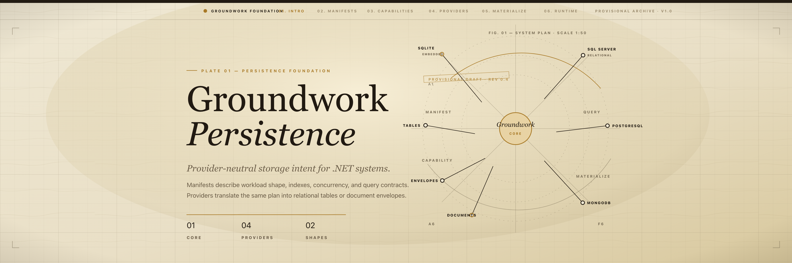

# Groundwork



Groundwork is a provider-neutral persistence foundation for .NET applications. Modules describe storage intent through manifests, and providers translate those manifests into concrete relational or document database structures.

This repository contains the standalone Groundwork library.

## Projects

- `Groundwork.Core`: manifests, storage intent, provider capability checks, validation, materialization concepts, and physicalization projection rules.
- `Groundwork.Documents`: portable document-store contracts and document planning.
- `Groundwork.Relational`: relational planning and shared relational document-store infrastructure.
- `Groundwork.Sqlite`: SQLite materialization and document-store provider.
- `Groundwork.SqlServer`: SQL Server materialization and document-store provider.
- `Groundwork.PostgreSql`: PostgreSQL materialization and document-store provider.
- `Groundwork.MongoDb`: MongoDB materialization and document-store provider.

## Requirements

- .NET SDK 10.0 or newer.
- Node.js and npm when rebuilding the support-ticket React client.
- Docker for provider tests that use container-backed databases.

## Build And Test

```bash
dotnet test tests/Groundwork/Groundwork.Tests/Groundwork.Tests.csproj
dotnet test tests/Groundwork/Groundwork.Sqlite.Tests/Groundwork.Sqlite.Tests.csproj
dotnet test samples/Groundwork.SupportTickets.Tests/Groundwork.SupportTickets.Tests.csproj
npm --prefix samples/Groundwork.SupportTickets/Client run build
```

Provider integration suites can be run separately when Docker-backed databases are available:

```bash
dotnet test tests/Groundwork/Groundwork.MongoDb.Tests/Groundwork.MongoDb.Tests.csproj
dotnet test tests/Groundwork/Groundwork.RelationalProviders.Tests/Groundwork.RelationalProviders.Tests.csproj
```

The support-ticket sample is an ASP.NET Core application backed by the same provider-neutral manifest used in its tests. It defaults to SQLite and can opt into optimized physicalization for every eligible index:

```bash
Groundwork__Provider=Sqlite \
Groundwork__ConnectionString="Data Source=support-tickets.db" \
Groundwork__Physicalization=Optimized \
dotnet run --project samples/Groundwork.SupportTickets/Groundwork.SupportTickets.csproj
```

Or keep the storage units portable and physicalize only named hot indexes:

```bash
Groundwork__Provider=Sqlite \
Groundwork__ConnectionString="Data Source=support-tickets.db" \
Groundwork__PhysicalizedIndexes="by-ticket-number,by-status" \
dotnet run --project samples/Groundwork.SupportTickets/Groundwork.SupportTickets.csproj
```

The sample also accepts `PostgreSql`, `SqlServer`, and `MongoDb` as `Groundwork__Provider` values when the matching connection string is supplied. For MongoDB, set `Groundwork__DatabaseName` when you want a database name other than `groundwork_support_tickets`.

## Use Groundwork

Groundwork starts with a provider-neutral `StorageManifest`. The manifest below declares a support-ticket document/table shape with string IDs, JSON content, optimistic concurrency, a unique ticket-number index, and queryable customer/status/assignee/priority indexes.

```csharp
using Groundwork.Core.Indexing;
using Groundwork.Core.Manifests;
using Groundwork.Core.Queries;
using Groundwork.Core.Intents;

const string DocumentKind = "supportTicket";
const string SchemaVersion = "1.0.0";

var manifest = new StorageManifest(
    new StorageManifestIdentity("support-tickets"),
    new StorageManifestOwner("sample.support"),
    new StorageManifestVersion(SchemaVersion),
    [
        new StorageUnit(
            new StorageUnitIdentity(DocumentKind),
            "Support ticket",
            StorageIntent.PortableDocument(),
            LifecyclePolicy.Mutable,
            IdentityPolicy.StringId(),
            TenancyPolicy.None,
            ConcurrencyPolicy.Optimistic(),
            SerializationPolicy.Json(),
            [
                Keyword("by-ticket-number", "ticketNumber", isUnique: true),
                Keyword("by-customer", "customerId"),
                Keyword("by-status", "status", physicalization: IndexPhysicalizationPolicy.Optimized),
                Keyword("by-assignee", "assigneeId"),
                Keyword("by-priority", "priority")
            ],
            [
                Query("find-by-ticket-number", "by-ticket-number"),
                Query("list-by-customer", "by-customer", QuerySortSupport.Both, QueryPagingSupport.Offset),
                Query("list-by-status", "by-status", QuerySortSupport.Both, QueryPagingSupport.Offset),
                Query("list-by-assignee", "by-assignee", QuerySortSupport.Both, QueryPagingSupport.Offset),
                Query("list-by-priority", "by-priority", QuerySortSupport.Both, QueryPagingSupport.Offset)
            ],
            PhysicalizationPolicy.Portable)
    ],
    new HashSet<string> { "schema-history", "optimistic-concurrency" },
    []);

static IndexDeclaration Keyword(
    string identity,
    string field,
    bool isUnique = false,
    IndexPhysicalizationPolicy physicalization = IndexPhysicalizationPolicy.Default) =>
    new(
        identity,
        [new IndexField(field)],
        IndexValueKind.Keyword,
        isUnique,
        true,
        MissingValueBehavior.Excluded,
        new HashSet<PortableQueryOperation> { PortableQueryOperation.Equal },
        physicalization);

static PortableQueryDeclaration Query(
    string identity,
    string indexName,
    QuerySortSupport sort = QuerySortSupport.None,
    QueryPagingSupport paging = QueryPagingSupport.None) =>
    new(
        identity,
        indexName,
        new HashSet<PortableQueryOperation> { PortableQueryOperation.Equal },
        sort,
        paging);
```

### Storage intent

Storage intent declares whether a unit fits Groundwork's portable document/table contract or needs additional evidence or provider-specific behavior:

- `StorageIntent.PortableDocument()`: Groundwork's default portable document/table contract.
- `StorageIntent.BenchmarkGated(...)`: possible future Groundwork support, but requires benchmark or correctness evidence.
- `StorageIntent.SpecializedProvider(...)`: requires a provider or module-specific contract.

Use specialized or benchmark-gated intent when correctness depends on behavior beyond ordinary document storage, such as atomic claiming, lease recovery, ordered consumption, retry recovery, idempotency, retention, atomic commit behavior, concurrency evidence, or operational diagnostics.

Configure SQLite by materializing the manifest, then create an `IDocumentStore` over the same connection:

```csharp
using Groundwork.Core.Capabilities;
using Groundwork.Documents.Store;
using Groundwork.Sqlite.Documents;
using Groundwork.Sqlite.Materialization;
using Microsoft.Data.Sqlite;

var connection = new SqliteConnection("Data Source=support-tickets.db");
var provider = new ProviderIdentity("groundwork-sqlite", "1.0.0");

await new SqliteGroundworkMaterializer(connection).MaterializeAsync(manifest, provider);

IDocumentStore store = new SqliteDocumentStore(connection, manifest);
```

Configure MongoDB with the same manifest:

```csharp
using Groundwork.Core.Capabilities;
using Groundwork.Documents.Store;
using Groundwork.MongoDb.Documents;
using Groundwork.MongoDb.Materialization;
using MongoDB.Driver;

var client = new MongoClient("mongodb://localhost:27017");
var database = client.GetDatabase("support");
var provider = new ProviderIdentity("groundwork-mongodb", "1.0.0");

await new MongoDbGroundworkMaterializer(database).MaterializeAsync(manifest, provider);

IDocumentStore store = new MongoDbDocumentStore(database, manifest);
```

Create, load, query, update, and delete support-ticket documents through the portable document-store contract. For quick scripts or tests, an anonymous object is enough because `IDocumentStore` stores JSON envelopes:

```csharp
using System.Text.Json;
using Groundwork.Documents.Store;

var ticket = new
{
    ticketNumber = "TCK-1001",
    customerId = "acme",
    subject = "Invoice export fails",
    description = "The monthly invoice export returns an empty file.",
    status = "open",
    priority = "high",
    assigneeId = "triage",
    openedAt = DateTimeOffset.UtcNow
};

var created = await store.SaveAsync(new SaveDocumentRequest(
    DocumentKind,
    ticket.ticketNumber,
    SchemaVersion,
    JsonSerializer.Serialize(ticket)));

if (created.Status != DocumentStoreWriteStatus.Saved)
    throw new InvalidOperationException($"Ticket was not saved: {created.Status}");

var loaded = await store.LoadAsync(DocumentKind, ticket.ticketNumber);

var openTickets = await store.QueryAsync(
    new DocumentStoreQuery(DocumentKind, "by-status", "open", skip: 0, take: 25));

var assignedTicketJson = """
    {
      "ticketNumber": "TCK-1001",
      "customerId": "acme",
      "subject": "Invoice export fails",
      "description": "The monthly invoice export returns an empty file.",
      "status": "assigned",
      "priority": "high",
      "assigneeId": "agent-alex",
      "openedAt": "2026-06-12T08:00:00Z"
    }
    """;

var updated = await store.SaveAsync(new SaveDocumentRequest(
    DocumentKind,
    "TCK-1001",
    SchemaVersion,
    assignedTicketJson,
    ExpectedVersion: created.Document!.Version));

if (updated.Status == DocumentStoreWriteStatus.ConcurrencyConflict)
    throw new InvalidOperationException("Ticket changed before the assignment was saved.");
if (updated.Status != DocumentStoreWriteStatus.Saved)
    throw new InvalidOperationException($"Ticket was not updated: {updated.Status}");

var deleted = await store.DeleteAsync(new DeleteDocumentRequest(
    DocumentKind,
    "TCK-1001",
    ExpectedVersion: updated.Document!.Version));
```

### Closed portable queries

For provider-neutral reads that go beyond a single equality, `IDocumentStore` also accepts a closed `PortableDocumentQuery`: an `AND` of `OR`-groups of single-field comparisons (`Equal`, `In`, `Contains`), with at most one ordering, optional offset paging, a total count, and a tenant-scope flag. Comparisons address a declared index by identity, and each operator must be declared on that index. The same query shape executes server-side on every provider (SQLite, SQL Server, PostgreSQL, MongoDB).

```csharp
using Groundwork.Documents.Store;

// status IN ('open','assigned') AND subject contains 'invoice' (case-insensitive),
// newest first, second page of 25, with the full predicate count.
var query = new PortableDocumentQuery(
    "supportTicket",
    [
        QueryClause.Of(QueryComparison.In("by-status", ["open", "assigned"])),
        QueryClause.Of(QueryComparison.Contains("by-subject", "invoice"))
    ],
    order: new QueryOrder("by-opened-at", Descending: true),
    skip: 25,
    take: 25);

DocumentQueryResult page = await store.QueryAsync(query);
long total = page.TotalCount;

DocumentEnvelope? first = await store.FirstOrDefaultAsync(query);
bool any = await store.AnyAsync(query);
```

Operator semantics match EF Core exactly: `Equal` with a `null` value matches documents whose field is null/absent; `In` over an empty set matches nothing; `Contains` is case-insensitive and a null field yields no match (never throws); an empty `QueryClause` (`QueryClause.MatchNone`) is a constant-false sentinel; and zero clauses match all documents of the kind. Queries are tenant-aware by default — pass `QueryTenantScope.TenantAgnostic` to bypass ambient tenant filtering, which is supplied to the store via an optional ambient-tenant accessor.

#### Declaring and detecting closed-query support

A `StorageUnit` declares which closed-query capabilities it supports through `PortableQueryDeclaration` entries on the manifest: the comparison `Operations` (`Equal`/`In`/`Contains`, validated against the index's `SupportedOperations`), `SortSupport` (single-field ordering, validated against the index's `IsSortable`), `PagingSupport` (offset paging), and the `SupportsDisjunction` (OR within a clause) and `SupportsTotalCount` flags. Adapters that want to skip an in-memory fallback can detect native support without trial execution:

```csharp
using Groundwork.Core.Queries;
using Groundwork.Documents.Store;

// Manifest-level profile: which operators/sort/paging a unit natively supports.
StorageUnitClosedQuerySupport support = ClosedQueryCapabilityModel.Describe(unit);
bool canContainsByName = support.SupportsOperator("by-name", PortableQueryOperation.Contains);

// Whole-query check: is this exact query shape executable server-side?
ClosedQuerySupportResult result = ClosedQueryNativeSupport.Evaluate(unit, query);
if (result.IsNativelySupported)
    await store.QueryAsync(query);     // native push-down
else
    /* fall back */;                   // result.Reasons explains why
```

#### Multi-document transactions

For write commands that persist several related documents all-or-nothing, an `IDocumentStore` is also an `IDocumentSessionFactory`: it begins a document unit of work over a declared `DocumentCommitScope`. This mirrors the operational `IOperationalSessionFactory`/`IOperationalUnitOfWork` shape. Staged `Save`/`Delete` operations are applied to the underlying database transaction and become visible only on `CommitAsync`; `RollbackAsync` (or disposing without committing) discards them.

```csharp
using Groundwork.Core.Transactions;
using Groundwork.Documents.Store;
using Groundwork.Documents.UnitOfWork;

// Detect native cross-document atomicity before committing to a path (no exception needed).
if (store.TransactionBoundary != TransactionBoundary.CrossUnitAtomic)
    /* use a compensation fallback */;

await using var unitOfWork = await store.BeginAsync(
    DocumentCommitScope.Of("workflow-version", "workflow-definition", "layout"));
try
{
    var saved = await unitOfWork.SaveAsync(new SaveDocumentRequest(/* version doc */));
    if (saved.Status != DocumentStoreWriteStatus.Saved)
    {
        await unitOfWork.RollbackAsync();   // all-or-nothing: caller rolls back on any non-success
        return;
    }

    await unitOfWork.SaveAsync(new SaveDocumentRequest(/* updated definition doc */));
    await unitOfWork.DeleteAsync(new DeleteDocumentRequest(/* stale layout record */));

    await unitOfWork.CommitAsync();
}
catch
{
    await unitOfWork.RollbackAsync();
    throw;
}
```

Contract:

- **Boundary detection.** `IDocumentSessionFactory.TransactionBoundary` reports `CrossUnitAtomic` when the store can commit multiple documents atomically, or `PerOperation` when it cannot — letting callers choose a compensation path without catching an exception.
- **Staging.** `SaveAsync`/`DeleteAsync` run against the open unit of work and return their normal `DocumentStoreWriteResult` immediately (including `ConcurrencyConflict`/`NotFound`). They are **not** auto-committed. The all-or-nothing guarantee is the caller's: roll back on any non-success result or exception.
- **Read-your-writes.** `LoadAsync` inside the unit of work sees staged writes.
- **Commit/rollback.** `CommitAsync` makes every staged change durable atomically; `RollbackAsync` (and `DisposeAsync` without a prior commit) discards them all. After completion, further operations throw.
- **Relational** (SQLite/PostgreSQL/SQL Server) is `CrossUnitAtomic`, backed by a real `DbTransaction` and serializing store access for the unit of work's lifetime. Note that some engines (e.g. PostgreSQL) abort the whole transaction on the first failed statement, so rollback is the only valid next step after a non-success result.
- **MongoDB** uses a multi-document transaction over a client session, which requires a **replica set or sharded** deployment (reported as `CrossUnitAtomic`). On a standalone deployment the boundary is `PerOperation` and `BeginAsync` throws `UnsupportedAtomicCommitException` (a loud failure rather than silent non-atomic writes) — that is the documented fallback contract for that topology.

For application code, use a regular CLR type and serialize it with the same JSON field names declared by the manifest indexes:

```csharp
public sealed class SupportTicket
{
    public required string TicketNumber { get; set; }
    public required string CustomerId { get; set; }
    public required string Subject { get; set; }
    public required string Description { get; set; }
    public required string Status { get; set; }
    public required string Priority { get; set; }
    public required string AssigneeId { get; set; }
    public DateTimeOffset OpenedAt { get; set; }
    public DateTimeOffset? ResolvedAt { get; set; }
}
```

```csharp
using System.Text.Json;
using Groundwork.Documents.Store;

var json = new JsonSerializerOptions(JsonSerializerDefaults.Web);

var ticket = new SupportTicket
{
    TicketNumber = "TCK-1002",
    CustomerId = "acme",
    Subject = "Workflow run is stuck",
    Description = "The workflow run remains in Running after all activities complete.",
    Status = "open",
    Priority = "normal",
    AssigneeId = "triage",
    OpenedAt = DateTimeOffset.UtcNow
};

var saved = await store.SaveAsync(new SaveDocumentRequest(
    DocumentKind,
    ticket.TicketNumber,
    SchemaVersion,
    JsonSerializer.Serialize(ticket, json)));

var envelope = await store.LoadAsync(DocumentKind, ticket.TicketNumber);
var loadedTicket = JsonSerializer.Deserialize<SupportTicket>(envelope!.ContentJson, json)!;

loadedTicket.Status = "assigned";
loadedTicket.AssigneeId = "agent-sam";

await store.SaveAsync(new SaveDocumentRequest(
    DocumentKind,
    loadedTicket.TicketNumber,
    SchemaVersion,
    JsonSerializer.Serialize(loadedTicket, json),
    ExpectedVersion: envelope.Version));
```

The same manifest also supports planning, validation, and provider capability checks before materialization:

```csharp
using Groundwork.Core.Capabilities;
using Groundwork.Core.Validation;
using Groundwork.Documents.Planning;

var manifestValidation = new StorageManifestValidator().Validate(manifest);
if (!manifestValidation.IsValid)
    throw new InvalidOperationException(string.Join(Environment.NewLine, manifestValidation.Errors));

var capabilityReport = ProviderCapabilityReport.PortableDocumentProvider(
    new ProviderIdentity("groundwork-sqlite", "1.0.0"));

var compatibility = new ProviderCapabilityValidator().Validate(manifest, capabilityReport);
if (!compatibility.IsCompatible)
    throw new InvalidOperationException(string.Join(Environment.NewLine, compatibility.Errors));

var documentPlan = new DocumentManifestPlanner(
    new StorageManifestValidator(),
    new ProviderCapabilityValidator()).Plan(manifest, capabilityReport);
```

Set `PhysicalizationPolicy.Optimized` on a storage unit when a provider should maintain native query projections for eligible declared indexes. SQLite creates provider tables for those projections, while MongoDB stores physicalized fields and indexes them natively.

## Sample

`samples/Groundwork.SupportTickets` demonstrates a small support ticket domain as an ASP.NET Core API with a React/Vite client. The same manifest runs against SQLite, PostgreSQL, SQL Server, or MongoDB.

The sample:

- defines `supportTicket` and `supportTicketComment` storage units with portable document intent;
- materializes the selected provider schema or collection metadata;
- creates and loads tickets and comments through `IDocumentStore`;
- queries by declared indexes;
- updates tickets with optimistic concurrency, including version-gated comment writes;
- serves a static React workspace from `wwwroot` and proxies client development requests through Vite.

Run it with:

```bash
Groundwork__Provider=Sqlite \
Groundwork__ConnectionString="Data Source=support-tickets.db" \
dotnet run --project samples/Groundwork.SupportTickets/Groundwork.SupportTickets.csproj
```

For client development, run the API and the Vite dev server separately:

```bash
GROUNDWORK_SUPPORT_TICKETS_API_URL=http://localhost:5000 \
npm --prefix samples/Groundwork.SupportTickets/Client run dev
```

The historical specs and Groundwork-focused planning notes are kept under `specs/` and `docs/`.
